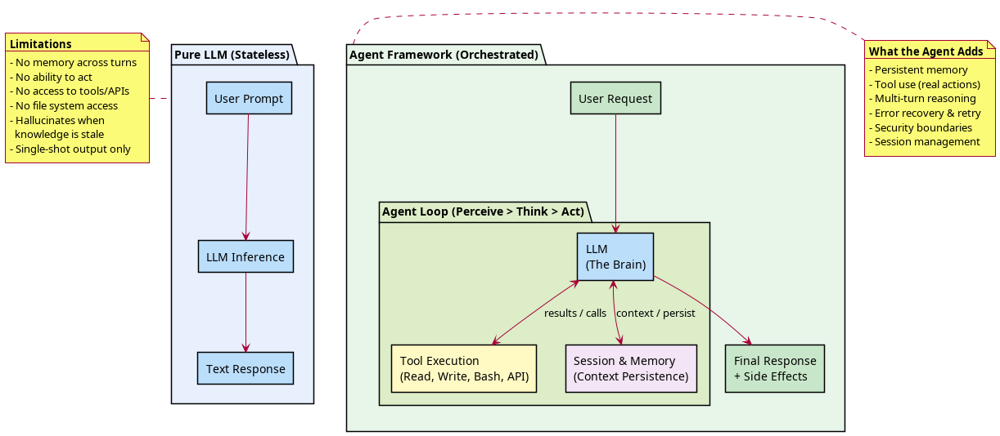
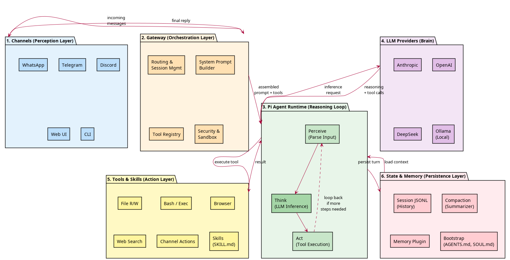

# OpenClaw Architecture Breakdown

This document systematically explains how and why OpenClaw is designed as an AI Agent system. It starts with first principles, builds up to the Agent design pattern, and then uses OpenClaw as a concrete case study.

---

## Part I: Why is an Agent Needed

### The Problem with a Bare LLM

A Large Language Model, in its raw form, is a **stateless text-completion engine**. You give it a prompt, it returns a response, and then it forgets everything. Every single call is an isolated prediction with no memory, no ability to act, and no access to the outside world.

This creates a fundamental gap between what users expect ("do this task for me") and what a bare LLM can actually deliver ("here is some text about how to do that task").

Consider what happens when you ask an LLM: *"Check the latest log file for errors and fix any bugs you find."*

A bare LLM can only **tell you** what it would do. It cannot read the log, cannot open the code, cannot edit the file, and cannot verify the fix. It has no hands, no eyes, and no memory.

### What an Agent Adds

An **Agent** is the runtime scaffolding that wraps an LLM and gives it the ability to **perceive, reason, and act** in a loop:

| Capability | Bare LLM | LLM + Agent |
| :--- | :--- | :--- |
| Read files / run commands | No | Yes (via tools) |
| Remember prior conversation | No | Yes (session persistence) |
| Call external APIs | No | Yes (tool integration) |
| Multi-step reasoning | Single pass only | Iterative loop |
| Error recovery | None | Retry, failover, compaction |
| Security enforcement | None | Sandbox, policy, allowlists |

The Agent acts as an **intermediary runtime loop**: it receives the user request, injects it into the LLM along with available tool definitions, lets the LLM reason about next steps, intercepts the LLM's tool call decisions, executes them in the real world, and feeds results back. This loop repeats until the task is complete.

### LLM Alone vs. LLM + Agent Framework

---

## Part II: Characteristics of Large Language Models

To design an effective Agent, you must first understand what the LLM (the "brain" inside the Agent) is genuinely good at and where it fundamentally fails.

### Strengths of LLMs

1. **Natural Language Understanding:** LLMs excel at parsing ambiguous, context-dependent human language and distilling actionable intent from it.
2. **Reasoning and Planning:** Given sufficient context, modern LLMs can decompose a complex task into a sequence of logical steps and decide which tool to invoke at each stage.
3. **Code Generation and Transformation:** LLMs have been trained on vast amounts of source code and can generate, edit, and debug programs across many languages.
4. **Knowledge Retrieval:** LLMs internalize a broad snapshot of public knowledge up to their training cutoff date, enabling them to provide domain expertise without real-time search.
5. **Adaptive Communication:** They can adjust tone, formality, language, and detail level based on conversational context.

### Fundamental Limitations of LLMs

1. **Statelessness:** Every call to the LLM is independent. It has no built-in memory of prior interactions. Without an external session/memory system, it cannot learn from or refer to previous turns.
2. **No Ability to Act:** An LLM cannot read a file, execute code, browse the web, or interact with any system. It can only *generate text that describes* those actions.
3. **Hallucination:** When the LLM lacks knowledge (or the question falls outside its training data), it confidently generates plausible-sounding but factually incorrect information instead of admitting uncertainty.
4. **Finite Context Window:** The LLM can only process a limited number of tokens per call. As conversation history grows, older context must be summarized (compacted) or pruned, creating a risk of losing important information.
5. **No Internal Verification:** The LLM cannot check its own output against reality. It cannot run a unit test, verify a file was written correctly, or confirm that a command succeeded.
6. **Training-Data Staleness:** The LLM's knowledge is frozen at its training cutoff date. It does not know about events, APIs, or library versions released after that date.

### The Implication for Agent Design

These characteristics directly dictate the architecture of any AI Agent system:

- **Statelessness** requires the Agent to provide a **Session Management** and **Memory** layer.
- **No Ability to Act** requires the Agent to provide a **Tool Execution** layer.
- **Hallucination** requires the Agent to provide **Grounding** through tool results, file contents, and verified data.
- **Finite Context Window** requires the Agent to implement **Compaction** and **Context Pruning** strategies.
- **No Internal Verification** requires the Agent to **observe tool results** and feed them back to the LLM for self-correction.
- **Training-Data Staleness** requires the Agent to integrate **Web Search** and **Real-time API** tools.

---

## Part III: How OpenClaw is Designed as an Agent (Case Study)

With the theoretical foundation in place, we now examine how OpenClaw implements each of these Agent principles in its architecture.

### Core Concepts

**OpenClaw** is a local-first, personal AI assistant orchestration system. It is designed to run on the user's own hardware, functioning as a central "Gateway" that bridges various Large Language Models (LLMs), messaging channels, and client interfaces, allowing the AI to execute local tasks safely.

### OpenClaw's Agent Architecture Mapped to the Pattern

The following diagram shows how OpenClaw's components map to the six layers of a well-designed Agent system:

| Agent Principle | LLM Limitation Addressed | OpenClaw Implementation |
| :--- | :--- | :--- |
| Perception Layer | LLM cannot receive input from diverse sources | Channels (WhatsApp, Telegram, Discord, Web UI, CLI) |
| Orchestration Layer | LLM has no concept of sessions, routing, or security | Gateway Control Plane (routing, system prompt building, tool registry, sandbox) |
| Reasoning Loop | LLM does single-pass inference only | Pi Agent Runtime (Perceive-Think-Act loop with iterative tool calls) |
| Brain (Pluggable) | Different LLMs have different strengths | Provider abstraction (Anthropic, OpenAI, DeepSeek, Ollama, and more) |
| Action Layer | LLM cannot act in the real world | Tools (file R/W, bash/exec, browser, web search, channel actions) and Skills |
| Persistence Layer | LLM is stateless | Session JSONL history, Compaction, Memory Plugin, Bootstrap files |

### How Each Layer Addresses a Specific LLM Limitation

#### Addressing Statelessness: Session and Memory

OpenClaw stores every conversation turn as structured JSONL files. When a new message arrives, the Pi Agent Runtime loads the session history and injects it into the LLM's context window. When the context window nears its limit, OpenClaw triggers **auto-compaction** to summarize older turns, keeping the conversation coherent without exceeding token limits.

Additionally, bootstrap files (`AGENTS.md`, `SOUL.md`, `TOOLS.md`) are injected at session start to provide stable personality, operating instructions, and tool usage conventions.

#### Addressing Inability to Act: Tool Injection Pipeline

OpenClaw gives the LLM "hands" by injecting a full menu of tool definitions (JSON Schemas) into the system prompt. The LLM reasons about which tool to use; the Pi runtime intercepts the tool call, executes it on the host machine (or in a Docker sandbox), and feeds the result back into the LLM's context.

Key tool categories include:

- **File System** (read, write, edit) for code and document manipulation
- **Bash/Exec** for running arbitrary commands
- **Browser** for web interaction
- **Web Search** (DuckDuckGo, Exa) for real-time information retrieval
- **Channel Actions** for sending messages through WhatsApp, Telegram, Discord, etc.
- **Skills** (loaded from `SKILL.md` files) for specialized capabilities

#### Addressing Hallucination: Grounding Through Tool Results

Instead of relying on the LLM's potentially stale or incorrect internal knowledge, the Agent loop forces the LLM to **verify claims by using tools**. When the LLM needs to know the contents of a file, it calls the `read` tool. When it needs up-to-date information, it calls `web_search`. The tool results are injected back into the context, providing ground truth that the LLM then uses to construct its response.

#### Addressing Context Limits: Compaction and Pruning

OpenClaw implements two strategies:

1. **Auto-Compaction:** When the session history approaches the model's context window limit, Pi triggers a compaction workflow that uses the LLM itself to summarize older turns into a compact summary, preserving key information while reducing token count.
2. **Cache-TTL Context Pruning:** A custom Pi extension tracks the "freshness" of context items and prunes stale entries before they consume valuable context budget.

#### Addressing Security: Sandbox and Policy

Because the Agent can execute arbitrary code on the user's machine, OpenClaw implements a tiered security model:

- **Host-First (Trusted Mode):** Direct execution for the owner's main session.
- **Sandboxed Mode:** Docker-isolated execution for untrusted/group contexts.
- **Tool Policy Filtering:** Allowlists and denylists control which tools are available per channel, user, and session type.

---

## Part IV: Technical Deep Dive

Parts I through III established *why* an Agent is needed, *what* the LLM brings and lacks, and *how* OpenClaw maps to the Agent design pattern. This part dives into the **implementation specifics**: the codebase structure, the SDK integration, and the configuration-level details that make the pattern concrete.

### Codebase Organization

The six Agent layers described in Part III are realized through four directory-level boundaries in the OpenClaw monorepo:

| Agent Layer (from Part III) | Codebase Location | What Lives There |
| :--- | :--- | :--- |
| Orchestration Layer | `/src` | Gateway Control Plane: WebSocket server, routing engine, session management, tool orchestration, system prompt builder |
| Perception Layer + Brain + Action Layer | `/extensions` | 80+ plugins: channel adapters (WhatsApp, Telegram, Discord, Matrix, etc.), LLM providers (Anthropic, OpenAI, DeepSeek, Groq, Ollama, etc.), and tool plugins (browser, web search, media understanding) |
| Perception Layer (client surfaces) | `/apps` and `/ui` | Web UI (Vite-powered SPA for WebChat and Dashboard), Native Nodes for macOS/iOS/Android (exposing Camera, Microphone, Screen Recording, Canvas UI over WebSocket), and CLI |
| Shared infrastructure | `/packages` | Reusable SDKs: `clawdbot`, `memory-host-sdk`, `moltbot` |

A key architectural decision: the Gateway core (`/src`) stays lean. Domain-specific capabilities (channel protocols, model provider quirks, specialized tools) are pushed into `/extensions` as plugins, keeping the orchestration layer decoupled from the specifics of any single channel, model, or tool.

### System Interaction Graph

The following diagram shows how messages flow through these boundaries at runtime:

### Pi Agent Runtime: Implementation Details

Part III introduced the **Reasoning Loop** as the layer that implements the Perceive-Think-Act cycle. In OpenClaw, this loop is powered by the **Pi Agent Runtime**, an embedded SDK rather than a standalone subprocess.

OpenClaw imports [pi-mono](https://github.com/badlogic/pi-mono) (specifically `pi-coding-agent` and its siblings) directly into the Gateway's Node.js process via `createAgentSession()`. This embedded approach, as opposed to subprocess RPC, gives OpenClaw programmatic control over every phase of the agent lifecycle:

#### SDK Integration Points

1. **Reasoning Loop (Perceive-Think-Act):** The Pi engine handles the inner turn-by-turn cycle. It sends the assembled prompt to the LLM provider, parses `<think>` reasoning blocks vs `<final>` answers, and fires tool executions dynamically before returning final text to the user. This is the concrete implementation of the iterative loop described in Part I.

2. **Tool Override Pipeline:** As described in Part III ("Addressing Inability to Act"), OpenClaw injects tool definitions into the LLM's prompt. At the implementation level, Pi brings default base tools (read, write, bash), but OpenClaw **replaces all of them**. It strips Pi's default implementations via `splitSdkTools()` and injects its own extended toolset, including browser control, channel-specific actions (e.g., `whatsapp_send`), and companion app sensors. All tools flow through `customTools` so that OpenClaw's policy filtering and sandbox integration apply uniformly.

3. **Session Events Hooking (Real-time Streaming):** OpenClaw subscribes to Pi's `AgentSession` events (`message_start`, `message_update`, `tool_execution_start`, `tool_execution_end`, `turn_end`, `auto_compaction_start`) to translate the AI's internal thought process into user-visible output. This enables real-time streaming updates in the Web UI and chunked block replies to messaging channels.

4. **Compaction Implementation:** As described in Part III ("Addressing Context Limits"), OpenClaw uses two compaction strategies. At the implementation level, Pi's `SessionManager` handles auto-compaction when token context approaches the model's window limit. OpenClaw adds two custom Pi extensions on top: a **Compaction Safeguard** (`compaction-safeguard.ts`) with adaptive token budgeting and tool failure summaries, and **Cache-TTL Context Pruning** (`context-pruning.ts`) that tracks freshness of context items and prunes stale entries.

5. **Dynamic Prompt Assembly:** At session start, the system prompt builder (`buildAgentSystemPrompt()`) reads locally maintained `.md` files (`AGENTS.md`, `SOUL.md`, `TOOLS.md`, `IDENTITY.md`, `USER.md`, and skills via `SKILL.md`) from `~/.openclaw/workspace/` and assembles them into the system prompt alongside tooling definitions, safety guardrails, and runtime metadata. This is how the "Persistence Layer" from Part III feeds stable context into each new reasoning turn.

#### Tooling Responsibility Split: LLM vs Pi

A critical design boundary in any Agent system is: **who decides what to do** vs **who does it**. In OpenClaw, this is cleanly split:

1. **Pi provides the "Menu":** Before each prompt, the Pi runtime bundles JSON Schema definitions for every available tool and sends them in the system prompt. The LLM sees this as: *"Here are the tools you can call, and here are the exact arguments each requires."*
2. **The LLM decides:** Using its reasoning capabilities (a core LLM strength from Part II), the LLM selects a tool and emits a structured tool call request within its response stream.
3. **Pi executes:** Pi intercepts the tool call from the LLM's streaming output, pauses further generation, runs the actual TypeScript backend code, and injects the raw result back into the LLM's context window. The LLM then continues reasoning with the new information. This is the concrete realization of the "observe tool results and feed them back" pattern described in Part II ("The Implication for Agent Design").

This loop repeats within a single user turn until the LLM determines no more tool calls are needed and emits a final response.

#### Pi Runtime Graph

### Security and Execution Model: Implementation Details

Part III introduced the three-tier security model at a conceptual level. Here we cover the **trust model rationale** and **configuration-level specifics** that govern how it operates.

#### Trust Model

OpenClaw is designed around a **Single-Operator Trust Model ("Personal Assistant")**. The system assumes the person running the Gateway is the trusted owner of the machine. The primary security concern is not protecting the owner from the AI, but preventing **external Prompt Injections** (from third parties messaging the bot through public channels) from escalating into host-level actions.

#### Configuration Details for the Execution Tiers

The three tiers described in Part III ("Addressing Security") are controlled by specific configuration keys:

1. **Host-First (Trusted Mode):** The default for the owner's Main Session. Tool executions (`bash`, `python`, `fs`) run directly on the host with the same privileges as the Gateway process. No additional configuration is required.
2. **Sandboxed Mode:** Activated by setting `agents.defaults.sandbox.mode` to `non-main` (sandbox non-owner sessions) or `all` (sandbox everything). When active, local execution tools are routed into a Docker container without host access, isolating untrusted inputs from channels like public Telegram groups or Discord servers.
3. **Restricted Tool Scopes:** Orthogonal to sandbox mode. Setting `tools.fs.workspaceOnly: true` forces all file system tools to operate exclusively within `~/.openclaw/workspace`, regardless of trust level.

#### Plugin Trust Boundary

One important security nuance not covered in Part III: custom plugins loaded from `/extensions` run **in-process** as part of the trusted computing base. They execute outside the Docker sandbox, with the same host privileges as the Gateway itself. This means installing a malicious or compromised plugin bypasses all sandbox protections. Plugin trust is therefore an operator-level decision, not a runtime-enforced boundary.

#### Security Boundary Graph

