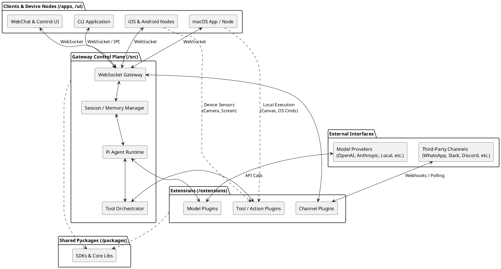
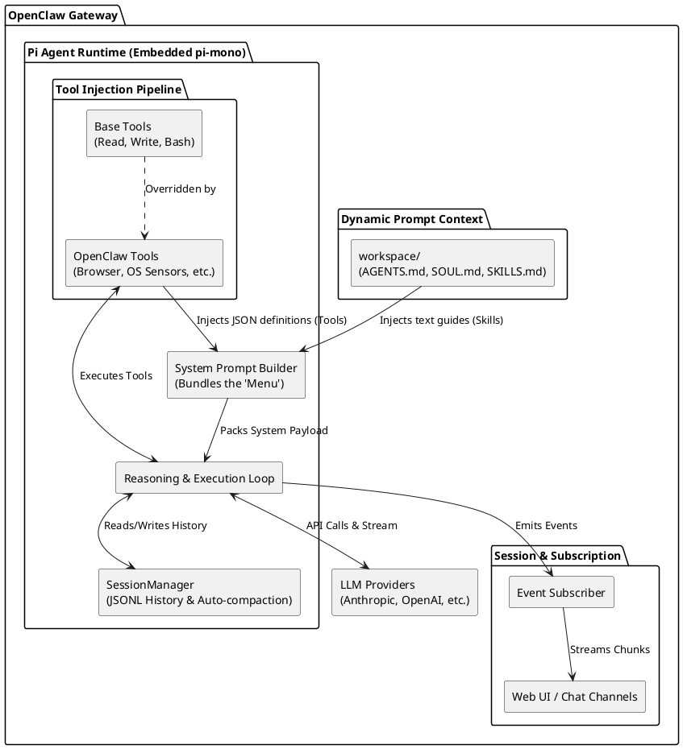
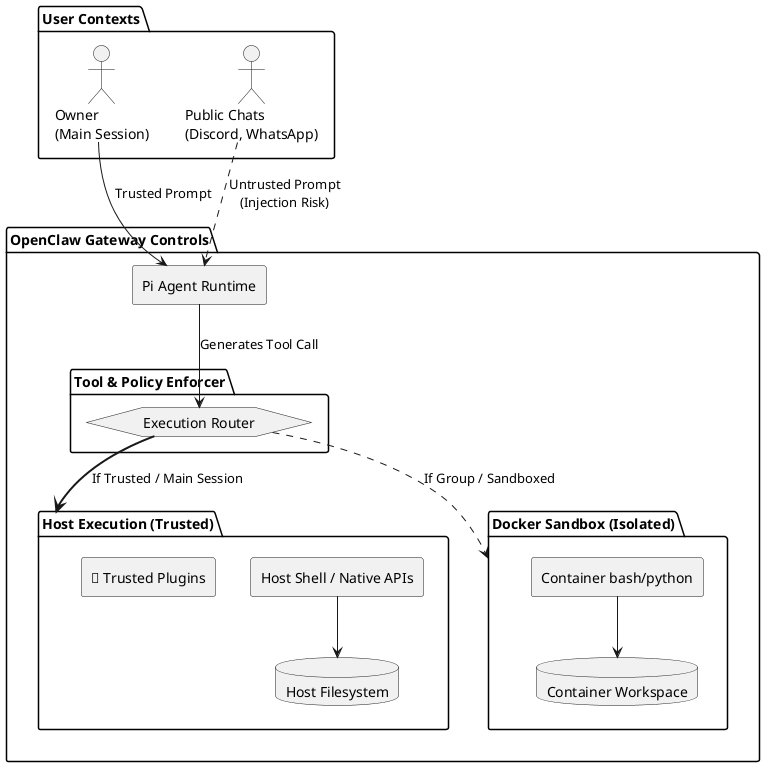

# OpenClaw Architecture Breakdown

Based on an investigation of the source code and documentation of the OpenClaw repository, here is the high-level architecture of the system.

## Core Concepts

**OpenClaw** is a local-first, personal AI assistant orchestration system. It is designed to run on the user's own hardware, functioning as a central "Gateway" that bridges various Large Language Models (LLMs), messaging channels, and client interfaces, allowing the AI to execute local tasks safely.

## Component Architecture

The codebase is organized into several distinct layers, clearly separated by directories at the root:

1. **Gateway Control Plane (`/src`)**
   This is the core of the system, acting as a WebSocket server and orchestration engine, written in TypeScript.
   - **Agent Runtime:** Processes AI workflows using a "Pi Agent" RPC model.
   - **Session & Memory Management:** Isolates different user chats and groups, storing context securely.
   - **Tool Orchestrator:** Manages execution of sandbox tools.
   - **Routing:** Directs messages between various channels and the agent.

2. **Extensions & Integrations (`/extensions`)**
   OpenClaw is highly extensible. The core is kept lean, while over 80 specific capabilities are loaded as plugins:
   - **Channels:** WhatsApp, Telegram, Slack, Discord, Matrix, etc.
   - **Models (LLMs):** OpenAI, Anthropic, DeepSeek, Groq, Ollama, HuggingFace, etc.
   - **Tools:** Browser control, Internet search (DuckDuckGo, Exa), and media understanding tools.

3. **Clients and Nodes Layer (`/apps` & `/ui`)**
   The surfaces where users interact with OpenClaw or where OpenClaw interfaces with device hardware.
   - **Web UI (`/ui`):** A Vite-powered React/Vue SPA that serves the WebChat and the Control Dashboard, hosted directly by the Gateway.
   - **Native Nodes (`/apps/macos`, `/apps/ios`, `/apps/android`):** Dedicated companion applications. They not only provide a chat interface but act as **Device Nodes**, exposing local hardware capabilities (Camera, Microphone, Screen Recording, Notifications, Canvas UI) over the WebSocket to the Gateway.
   - **CLI:** Command-line tooling for onboarding, management, and chatting directly from the terminal.

4. **Shared SDKs (`/packages`)**
   Reusable libraries that support the ecosystem, such as `clawdbot`, memory interfaces (`memory-host-sdk`), and `moltbot`.

## System Graph

Below is a visual representation of how these components interact:

## Pi Agent Runtime (Deep Dive)

The **Pi Agent Runtime** is the core reasoning loop embedded inside the Gateway. Instead of building the AI orchestration from scratch, OpenClaw natively embeds [pi-mono](https://github.com/badlogic/pi-mono) (specifically `pi-coding-agent` and its siblings) via SDK.

Because it's instantiated directly in the Node process instead of a separate RPC shell, OpenClaw maintains high-level programmatic control over the AI:

### Key Pi Implementations

1. **The Reasoning Loop:** The Pi engine handles the inner turn-by-turn logic. It interfaces with the LLM providers, parses `<think>` logic tags vs `<final>` answers, and fires tool executions dynamically before returning the final text to the user.
2. **Tool Injection Pipeline:** Pi brings base tools (read, write, bash). OpenClaw intercepts this pipeline, stripping default implementations and injecting its own massive toolset, creating a seamless connection to the browser, physical sensors on companion apps, and API actions.
3. **Session Events Hooking:** OpenClaw translates the AI's internal thought process to the outside world. By subscribing to Pi's `AgentSession` events (`message_update`, `tool_execution_start`, `turn_end`), OpenClaw can update the Web UI in real-time or send chunked streaming replies to chat platforms like WhatsApp.
4. **History & Compaction (`SessionManager`):** The Pi core handles local conversation persistence as structured JSONL. When token context approaches its limit dynamically across devices, Pi triggers auto-compaction workflows to summarize older turns seamlessly to save tokens while keeping context limits in check.
5. **Dynamic Prompt Context:** Upon a session start, the Pi agent grabs locally maintained `.md` files (like `AGENTS.md`, `SOUL.md`, and skills via `SKILL.md`) from the host's `~/.openclaw/workspace/` and injects them to formulate the base character and operating parameters dynamically.

### Tooling Responsibility: LLM vs Pi

In the OpenClaw architecture (and modern agentic frameworks in general), the decision of exactly *which* tool to use is always made by the **LLM itself**, while **Pi** handles the orchestration and execution. Here is how the workflow is split:

1. **Pi Provides the "Menu":** Before the prompt is sent, the Pi Agent Runtime bundles the strict definitions (JSON Schemas) for every available tool (e.g., `browser`, `read_file`, `exec`, `whatsapp_send`). It sends this entire menu into the LLM's system prompt payload, effectively saying: *"Here are the specific tools you can use, and here are the exact arguments each one requires."*
2. **The LLM Decides:** The LLM reads the user's request and its available tools. It uses its reasoning capabilities to decide which tool to use. The LLM outputs a structured response (often inside a `<think>` block) essentially demanding a tool execution: `CALL TOOL: duckduckgo_search(query="Tokyo weather")`.
3. **Pi Executes:** Pi intercepts the LLM's streaming response, recognizes the tool request, pauses the LLM, and runs the actual TypeScript backend code to perform the web search. Once the physical action is complete, Pi pastes the raw output back into the LLM's context window, allowing the LLM's "brain" to continue reasoning based on the new results.

### Pi Runtime Graph

## Security & Execution Model

OpenClaw is designed around a **Single-Operator Trust Model ("Personal Assistant")**. The system assumes the person running the Gateway is the trusted owner of the machine. The security architecture focuses heavily on preventing *external* Prompt Injections (from third parties messaging the bot) from damaging the underlying operating system.

### Execution Tiers & Sandboxing

1. **Host-First (Trusted Mode):** By default, when the owner talks to OpenClaw via the Main Session, tool executions (`bash`, `python`, `fs`) run directly on the host machine with the same privileges as the Gateway process.
2. **Sandboxed Mode (Untrusted / Group Contexts):** For channels with potentially adversarial users (like public Telegram groups or Discord servers), OpenClaw uses Docker Sandboxes. When `agents.defaults.sandbox.mode` is set to `non-main` or `all`, local execution tools are forcibly routed into an isolated Linux container without host access.
3. **Restricted Tool Scopes:** Regardless of sandbox mode, tools can enforce filesystem boundaries. For example, `tools.fs.workspaceOnly: true` forces the AI to only read/edit files inside `~/.openclaw/workspace`, keeping the rest of your machine safe.
4. **Plugins / Extensions:** Custom plugins are loaded *in-process*. They are part of the trusted computing base. Installing a malicious plugin compromises the host, as it runs outside the Docker sandbox.

### Security Boundary Graph

